# **README**

## **1. Overview**
This project implements a **data engineering pipeline** to process, store, and analyze transactional data for a retail business. The solution follows a modular approach using **Pandas** and **PySpark** for data processing, **Snowflake** for storage, and SQL queries for business insights. The pipeline adheres to a **star schema design** for optimized storage and efficient querying, ensuring scalability and maintainability.

## **2. Solution Breakdown**

### **Task 1: Data Ingestion**
- **Objective**: Load raw data, clean it, and prepare it for downstream processing.
- **Data Sources**:
  - `transactions.csv`: Contains details about customer purchases.
  - `users.csv`: Contains customer demographic information.
  - `products.csv`: Contains product metadata.

- **Steps**:
  1. **Load Raw Data**:
     - Load CSV files into PySpark DataFrames using the `read.csv` function.

     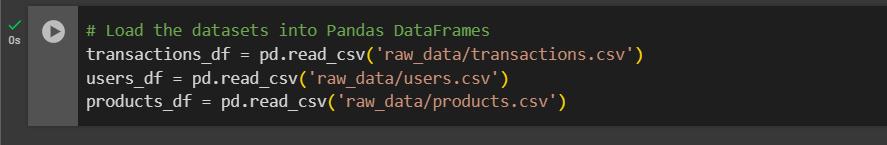

  2. **Inspect Data**:
     - Check for missing values, duplicates, and data type inconsistencies.
    
    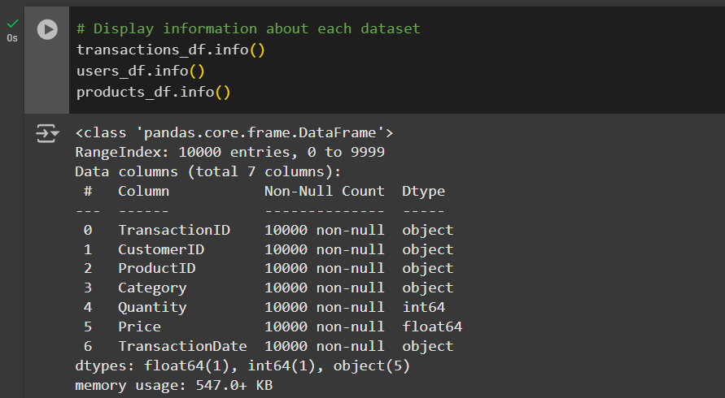
    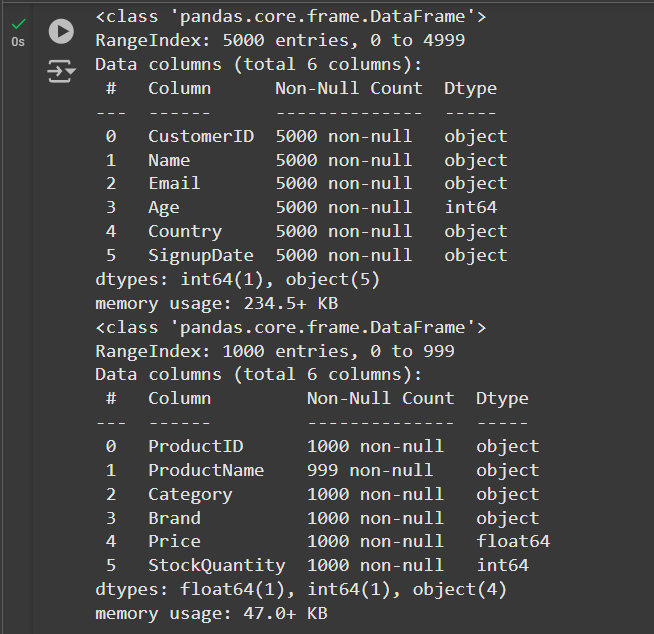

    ### **Summary for Data Inspecting**
    - Total Rows: 
      - Transactions: 10,000
      - Users: 5,000
      - Products: 1,000
    - Total Columns: 
      - Transactions: 7
      - Users: 6
      - Products: 6
    - Columns to Convert:
      - `TransactionDate` → `datetime`
      - `SignupDate` → `datetime`
    - Missing Data:
      - `ProductName` → 1 missing value.
    
  ---
  3. **Clean Data**:
     - Remove duplicates.

    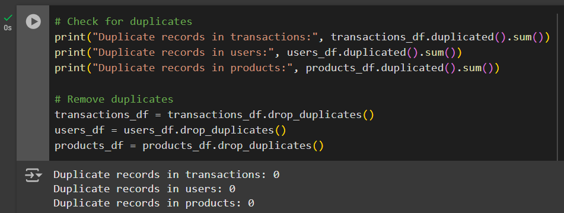

     - Handle missing values (`ProductName` imputed with "Unknown").

    

    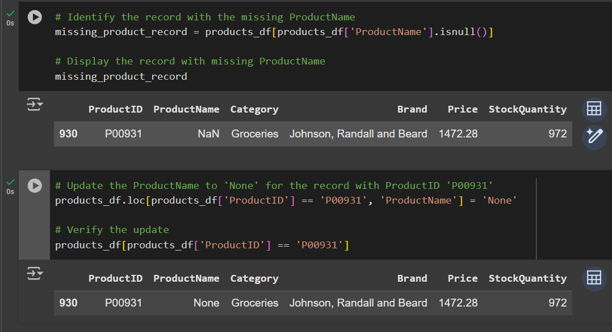

     - Convert `TransactionDate` and `SignupDate` to `datetime` format.

    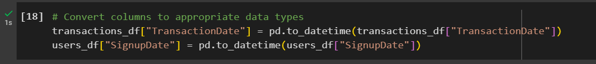
    

    - Remove Invalid Records

    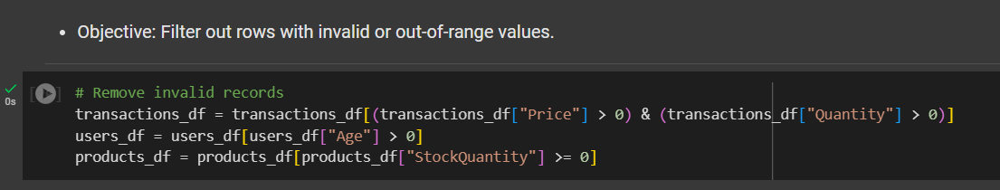

  4. **Save Cleaned Data**:
     - Save cleaned DataFrames as a CSV files for staging.

    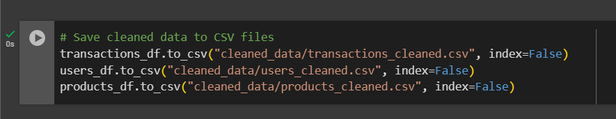
    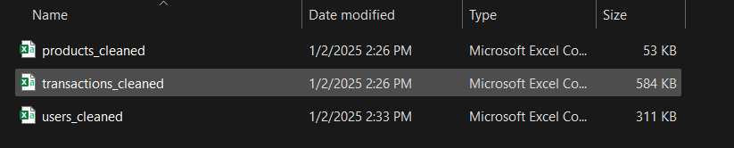

### **Task 2: Data Transformation**
- **Objective**: Create `CustomerTransactionSummary` and `ProductPerformance` tables from the cleaned data.
- **Details**:
  - **`CustomerTransactionSummary`**:
    - Columns: `CustomerID`, `TotalSpent`, `TotalTransactions`, `LastTransactionDate`.
    - Calculations:
      - `TotalSpent`: Sum of `Quantity * Price` per customer.
      - `TotalTransactions`: Count of transactions per customer.
      - `LastTransactionDate`: Latest transaction date.

    ### Step 1: Initialize PySpark and Load Data

    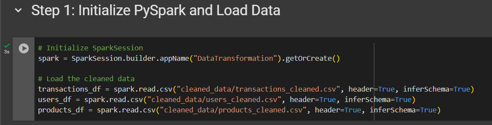

    ### Step 2: Create CustomerTransactionSummary

    
    
  - **`ProductPerformance`**:
    - Columns: `ProductID`, `TotalSales`, `AveragePrice`, `UnitsSold`.
    - Calculations:
      - `TotalSales`: Sum of `Quantity * Price` per product.
      - `AveragePrice`: Average price per product.
      - `UnitsSold`: Sum of quantities sold.

    ### Step 3: Create ProductPerformance

    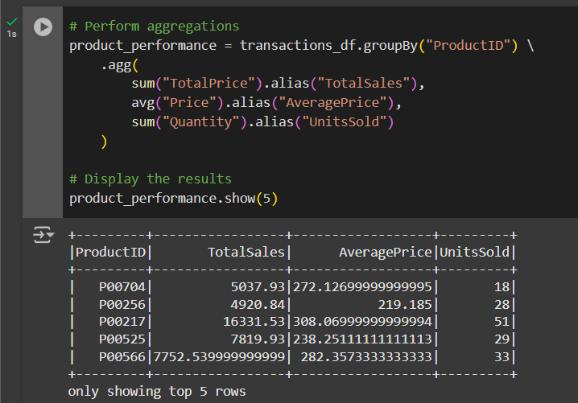

    ### Step 4: Save the Transformed Tables

    

    ### Step 5: Verify the Transformed Data

    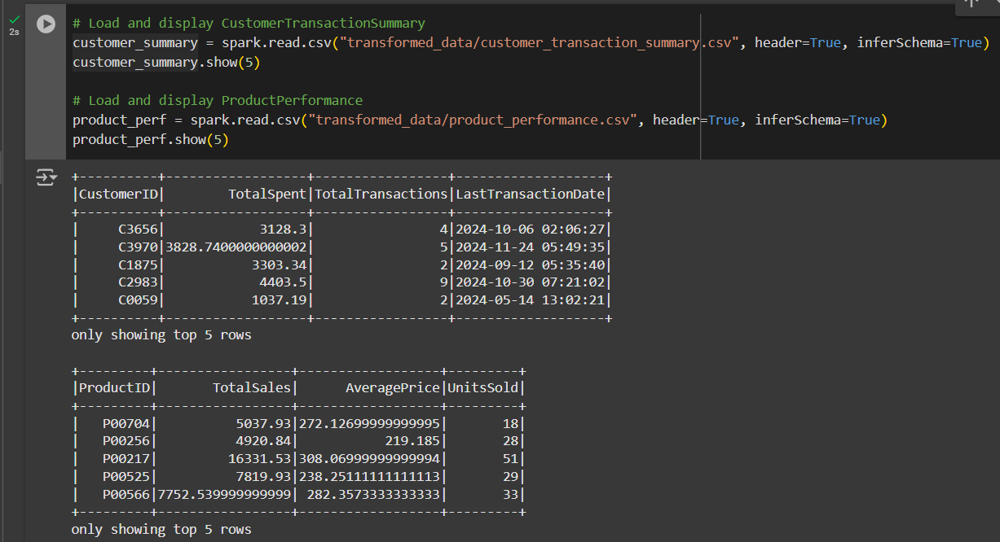

### **Task 3: Data Storage**
- **Objective**: Store the transformed data in a relational database using a star schema.
- **Star Schema Design**:

  

  - **FactTransaction**:
    - Contains transactional details.

    
    
    

  - **DimCustomer**:
    - Contains customer information.

  
  
  

  - **DimProduct**:
    - Contains product metadata.

  
  
  

- **Storage**:
  - Tables created in Snowflake using SQL scripts.

### **Task 4: SQL Analysis**
- **Objective**: Extract business insights using SQL queries.
  1. **Top 5 Customers by Spending**:
     - Identify the top customers by total spending.

    
    

  2. **Best-Selling Products**:
     - Determine the best-selling product in each category.

    
    

  3. **Daily Sales Trends**:
     - Analyze sales trends over the last 7 days.

    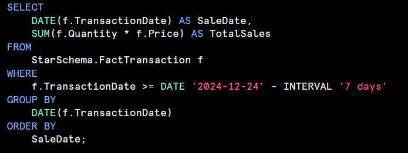
    

  4. **Category with Highest Sales**:
     - Find the category with the highest sales in the last month.

    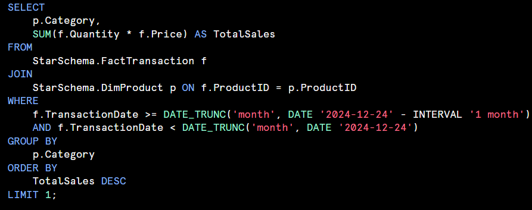
    

### **Task 5: Optimization**
- **Objective**: Improve scalability and performance.
- **Techniques**:
  - **Caching**: Use `.cache()` to store frequently used DataFrames in memory.

    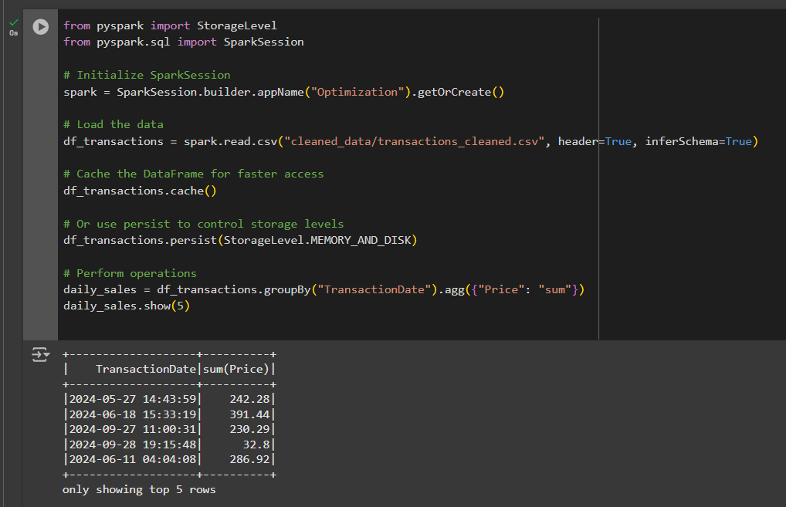

    #### **When to Use**:
    - Cache when a DataFrame is reused multiple times in the same job.
    - Use `persist` if the DataFrame is too large for memory, as it spills to disk.

  - **Partitioning**: Partition data by `TransactionDate` into 3-month intervals for parallel processing.

    ### **Step 1: Define the Quarters**
    1. **Quarters for Partitioning**:
       - Q1: `Dec 24, 2023` to `Mar 23, 2024`
       - Q2: `Mar 24, 2024` to `Jun 23, 2024`
       - Q3: `Jun 24, 2024` to `Sep 23, 2024`
       - Q4: `Sep 24, 2024` to `Dec 23, 2024`

    2. **Create a Helper Column**:
       - Add a column `Quarter` to categorize each transaction into one of these intervals.
    
    ### **Step 2: Add Quarter Column**
    - Use PySpark to calculate the quarter dynamically:

    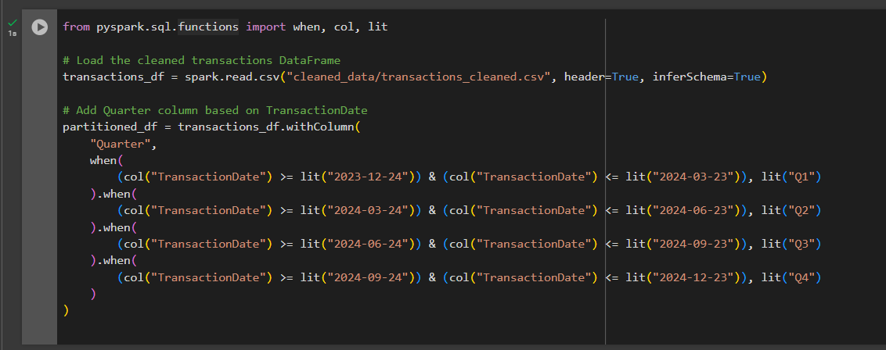

    ### **Step 3: Partition the Data**
    - Partition the data by the `Quarter` column and save it:

    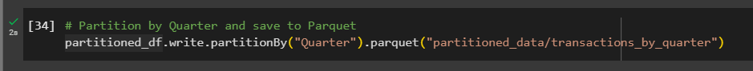

    ### **Step 4: Verify the Partitioned Data**

    

    ### **Benefits of Partitioning**
    1. **Query Optimization**:
       - Queries filtering by `Quarter` will only read relevant partitions, reducing data   scan size.
    2. **Parallel Processing**:
       - Spark processes each partition independently, improving performance on     distributed clusters.
    
---

## **3. Assumptions and Challenges**

### **Assumptions**
1. The input data adheres to the expected schema.
2. `TransactionDate` and `SignupDate` are accurate and follow the ISO datetime standard.
3. The data contains no duplicate primary keys (e.g., `CustomerID`, `ProductID`).

### **Challenges**
1. **Handling Missing Data**:
   - Solution: Imputed missing values or excluded incomplete rows.
2. **Scaling for Large Datasets**:
   - Solution: Implemented partitioning and caching to optimize processing.
3. **Efficient SQL Queries**:
   - Solution: Used indexes and optimized joins for performance.

---

## **4. How to Run the Pipeline**

### **Setup**
1. **Open Google Colab**:
   - Ensure you have access to Google Colab by visiting [Google Colab](https://colab.research.google.com).
   
### **Steps**

#### **Step 1: Data Ingestion**
1. Upload your raw CSV files (`transactions.csv`, `users.csv`, `products.csv`) to the Colab environment in the `raw_data` folder after you created.

2. Run the ingestion code to clean and stage the data:

#### **Step 2: Data Transformation**
1. Run the transformation code in Colab.

2. Download the results to your local machine.

---

### **Notes**
- All scripts should be executed cell-by-cell in Google Colab.

---

## **5. Scalability**

### **1. Partitioning**
- Partitioned transactional data by 3-month intervals to enable parallel processing.

### **2. Caching**
- Cached DataFrames used in multiple transformations to reduce recomputation.

### **3. Bucketing**
- Bucketed `CustomerID` and `ProductID` for faster joins.

### **4. Cloud Storage**
- Designed for cloud-based storage solutions like Snowflake to handle terabytes of data.