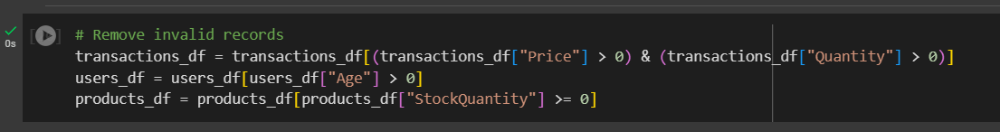
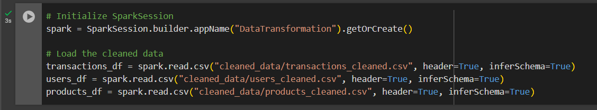

# **README**

## **1. Overview**
This project implements a **scalable data engineering pipeline** to process, transform, and analyze retail transactional data. Using **PySpark** and **Pandas** for distributed data processing and **Snowflake** for storage, the pipeline is designed to handle large-scale data efficiently. It ingests raw data, cleans and validates it, organizes it into a **star schema**, and generates actionable insights through optimized SQL queries. The solution incorporates techniques such as **partitioning**,  and **caching** to ensure scalability and performance.

----

### **2. Objective**

The general objective of this project is to implement a scalable and efficient data pipeline for processing and analyzing retail transactional data.

#### **Specific Objectives**:
- **Ingest raw data**: Load and clean data from CSV files to ensure data integrity.
- **Transform data**: Generate meaningful summary tables for analysis.
- **Organize data**: Implement a star schema design for optimized storage.
- **Store data**: Use Snowflake for structured data storage.
- **Analyze data**: Extract business insights through SQL queries.
- **Optimize pipeline**: Apply partitioning, and caching to handle large-scale data.

## **3. Solution Breakdown**

### **Task 1: Data Ingestion**
- **Objective**: Load raw data, clean it, and prepare it for downstream processing.
- **Data Sources**:
  - `transactions.csv`: Contains details about customer purchases.
  - `users.csv`: Contains customer demographic information.
  - `products.csv`: Contains product metadata.

- **Steps**:
  1. **Load Raw Data**:
     - Load CSV files into PySpark DataFrames using the `read.csv` function.

     

    ---

  2. **Inspect Data**:
     - Check for missing values, duplicates, and data type inconsistencies.
    
  
  

    **Summary for Data Inspecting**
    - Total Rows: 
      - Transactions: 10,000
      - Users: 5,000
      - Products: 1,000
    - Total Columns: 
      - Transactions: 7
      - Users: 6
      - Products: 6
    - Columns to Convert:
      - `TransactionDate` → `datetime`
      - `SignupDate` → `datetime`
    - Missing Data:
      - `ProductName` → 1 missing value.
    
  ---
  3. **Clean Data**:
     - Remove duplicates.

  

    **Summary: Duplicate Records**

  - **Transactions Dataset**: No duplicate records were found.
  - **Users Dataset**: No duplicate records were found.
  - **Products Dataset**: No duplicate records were found.

  While no duplicates were identified, this inspection step ensures that the data used for downstream processing and analysis is clean  and reliable.

  ---

     - Handle missing values (`ProductName` imputed with "Unknown").

  
  

    **Summary: Missing Values**

  During the data cleaning process, the datasets were inspected for missing values. The inspection revealed:

  - No missing values in the **transactions** or **users** datasets.
  - In the **products** dataset, the value "None" in the `ProductName` column for `ProductID P00931` was initially interpreted as a   missing value.

  **Handling the Identified Value:**
  - Upon closer inspection, the value "None" was reclassified as a legitimate product name, rather than a missing value. 
  - This was explicitly processed to ensure "None" is retained as the `ProductName` for `ProductID P00931`.

  ---
     - Convert `TransactionDate` and `SignupDate` to `datetime` format.

  
  

  ---
    - Remove Invalid Records

  

  **Summary: Invalid Record Removal**

  To ensure data quality, rows with invalid or out-of-range values were filtered out during the cleaning process. The following   validations were applied:

  - **Transactions Dataset**:
    - Rows with `Price` less than or equal to zero were removed.
    - Rows with `Quantity` less than or equal to zero were also removed.

  - **Users Dataset**:
    - Rows with `Age` less than or equal to zero were filtered out.

  - **Products Dataset**:
    - Rows with `StockQuantity` less than zero were excluded.

  These validations helped maintain the integrity of the dataset by ensuring that only meaningful and valid data was retained for   further processing.

  ---
  4. **Save Cleaned Data**:
     - Save cleaned DataFrames as a CSV files for staging.

  
  

### **Task 2: Data Transformation**
- **Objective**: Create `CustomerTransactionSummary` and `ProductPerformance` tables from the cleaned data.

    ### Step 1: Initialize PySpark and Load Data

  

  ---
    ### Step 2: Create CustomerTransactionSummary table

  - **`CustomerTransactionSummary`**:
    - Columns: `CustomerID`, `TotalSpent`, `TotalTransactions`, `LastTransactionDate`.
    - Calculations:
      - `TotalSpent`: Sum of `Quantity * Price` per customer.
      - `TotalTransactions`: Count of transactions per customer.
      - `LastTransactionDate`: Latest transaction date.

  

  **Summary: CustomerTransactionSummary table**

  In this step, a **CustomerTransactionSummary** was created to analyze customer purchase behavior. The resulting table provides a  clear summary of customer spending habits, transaction frequency, and recency of activity, which can be used for customer  segmentation, loyalty analysis, and targeted marketing strategies. The table shows that customers such as `C3566` and `C3970`  exhibit high spending and frequent transactions.

  ---
    ### Step 3: Create ProductPerformance table 

  - **`ProductPerformance`**:
    - Columns: `ProductID`, `TotalSales`, `AveragePrice`, `UnitsSold`.
    - Calculations:
      - `TotalSales`: Sum of `Quantity * Price` per product.
      - `AveragePrice`: Average price per product.
      - `UnitsSold`: Sum of quantities sold.
  
  

  **Summary: ProductPerformance table**

  In this step, a **ProductPerformance** was generated to evaluate the sales performance of individual products. 

  This summary highlights the revenue contribution and popularity of each product. For instance:
  - Product `P00217` had the highest **TotalSales** of 16,331.53 and **UnitsSold** of 51, indicating strong performance in both sales   volume and revenue.
  - Product `P00256` had a relatively low **AveragePrice** of 219.18 but maintained steady sales with **UnitsSold** of 28.

  These insights can guide inventory management, pricing strategies, and promotional efforts.

  ---
    ### Step 4: Save the Transformed Tables

    

  ---
    ### Step 5: Verify the Transformed Data

    

  **Summary: Verification of Transformed Data**

  The transformed data was successfully loaded and displayed to ensure correctness. Both `CustomerTransactionSummary` and   `ProductPerformance` tables were reviewed for accuracy after transformations. The verification step confirmed that the data was   properly aggregated, structured, and ready for downstream processes, with no discrepancies observed during the inspection.

---
### **Task 3: Data Storage**
- **Objective**: Store the transformed data in a relational database using a star schema.

  For this project, the Snowflake Data Warehouse technology was chosen to store the transformed data due to its scalability,  performance, and flexibility in handling structured data. Snowflake's cloud-based architecture makes it an ideal choice for  implementing a star schema and executing analytical queries efficiently.
  
  ---
- **Star Schema Design**:

  

  **Star Schema Design: Relationship Summary**

  The star schema is a data warehousing design approach that organizes data into a central fact table surrounded by dimension tables.   This structure is optimized for analytical queries and reporting, with the following relationships:

  1. **FactTransaction (Central Table)**:
     - Acts as the core of the schema, holding transactional data.
     - Links to dimension tables through foreign keys (`CustomerID` and `ProductID`).

  2. **DimCustomer and DimProduct (Dimension Tables)**:
     - **DimCustomer** provides descriptive data about customers.
     - **DimProduct** provides contextual information about products.

  3. **Relationships**:
     - **One-to-Many**:
       - Each customer in **DimCustomer** can have multiple associated transactions in **FactTransaction**.
       - Each product in **DimProduct** can appear in multiple transactions in **FactTransaction**.
     - These relationships enable flexible querying for analytics, such as aggregating sales by customer or product.

  ---
  ### Step 1: Database Creation
  
  To store the transformed data, the first step is to create a database in your relational database management system. In this case, the database is named `shega_data_warehouse`.

  

  ---
  ### Step 2: Schema Creation

  Once the database is created, the next step is to create a schema within the database to logically group related tables. In this case, the schema is named `StarSchema`.

  

  ---
  ### Step 3: FactTransaction Table Creation
    - Contains transactional details.

  
  
  

  **Summary for FactTransaction Data Loading**

  - The **FactTransaction** table was successfully created in the `StarSchema` schema with fields to store transactional details,   including `TransactionID`, `CustomerID`, `ProductID`, `Quantity`, `Price`, and `TransactionDate`.

  - Foreign key relationships were established to reference the `DimCustomer` and `DimProduct` dimension tables, ensuring data  integrity and facilitating efficient joins.

  - **Data Ingestion**:
    - A total of **10,000 rows** were successfully loaded from the cleaned `transactions_cleaned.csv` file into the `FactTransaction`   table.
    - The column mappings were verified to align with the schema definition.

  ---
  ### Step 4: DimCustomer Table Creation
    - Contains customer information.

  
  
  

  **Summary for DimCustomer Data Loading**

  - The **DimCustomer** table was successfully created in the `StarSchema` schema to store customer-related information. The table  includes fields such as `CustomerID`, `Name`, `Email`, `Age`, `Country`, and `SignupDate`.

  - **Data Ingestion**:
    - Data from the cleaned `users_cleaned.csv` file was successfully loaded into the `DimCustomer` table.
    - A total of **5,000 rows** were ingested, ensuring the cleaned data aligns with the schema structure.

  - **Schema Validation**:
    - All columns were correctly mapped from the source file to the target table.
    - No missing or mismatched data was identified during the data loading process.

  ---
  ### Step 5: DimProduct Table Creation
    - Contains product metadata.

  
  
  

  **Summary for DimProduct Data Loading**

  - The **DimProduct** table was successfully created in the `StarSchema` schema to store product-related metadata. The table includes  fields such as `ProductID`, `ProductName`, `Category`, `Brand`, `Price`, and `StockQuantity`.

  - **Data Ingestion**:
    - Data from the cleaned `products_cleaned.csv` file was successfully loaded into the `DimProduct` table.
    - A total of **1,000 rows** were ingested, ensuring the data is consistent with the schema structure.

---
### **Task 4: SQL Analysis**
- **Objective**: Extract business insights using SQL queries.

  ---
  1. **Top 5 Customers by Spending**:
     - Identify the top five customers by total spending.

  
  

  **Findings: Top 5 Customers by Spending**

  The query identifies the top 5 customers based on their total spending. The results reveal that:

  1. **Dawn Fry** is the highest spender with a total expenditure of **$91,934.7**.
  2. **Christopher Cruz** follows closely with a spending of **$90,574.8**.
  3. **Emily Richardson**, **Krista Kelley**, and **Chelsea Li** complete the top 5, with expenditures ranging from **$88,795.61** to   **$85,796.93**.

  These high-spending customers represent significant value to the business and could be targeted for loyalty programs or personalized  marketing initiatives.

  ---
  2. **Best-Selling Products**:
     - Determine the best-selling product in each category.

  
  

  **Findings: Best-Selling Products by Category**

  This query identifies the top-selling product in each category based on total units sold. The results indicate:

  1. **Books**: The best-selling product is "True" with **59 units sold**.
  2. **Electronics**: "Provide" leads the category with **69 units sold**.
  3. **Fashion**: The most popular product is "Reality" with **60 units sold**.
  4. **Groceries**: "Low" is the best-seller with **67 units sold**.
  5. **Home Appliances**: "Represent" tops the category with **71 units sold**.
  6. **Sports**: "Success" dominates the category with **70 units sold**.

  These insights highlight the most popular products in each category, helping the business focus on inventory optimization and   targeted marketing for high-demand products.

  ---
  3. **Daily Sales Trends**:
     - Analyze sales trends over the last 7 days.

  
  

  **Findings: Daily Sales Trends**

  This query analyzes sales trends over the 7 days leading up to **December 24, 2024**, assuming the query was executed on this date  and considering the last transactions up to **December 23, 2024**. The results indicate the following:

  #### Insights:
  1. **Highest Sales**:
     - The highest sales occurred on **December 20, 2024**, with a total of **25,176.03** in sales.

  2. **Lowest Sales**:
     - The lowest sales occurred on **December 23, 2024**, with a total of **3,000.21** in sales.

  3. **Consistent Activity**:
     - The daily sales show fluctuations, with significant peaks and drops throughout the week, indicating varying customer activity.

  #### Assumptions:
  - This analysis assumes that the data reflects all transactions performed in the 7 days prior to **December 24, 2024**.
  - The insights rely on the completeness of the transaction data, with the last recorded transaction made on **December 23, 2024**.

  ---
  4. **Category with Highest Sales**:
     - Find the category with the highest sales in the last month.

  
  

  **Findings: Category with Highest Sales**

  This query identifies the product category with the highest total sales in the last month, covering the period from **November 24,  2024**, to **December 23, 2024**, assuming the query was executed on **December 24, 2024**, and considering all transactions   performed up to **December 23, 2024**.

  #### Insights:
  1. **Highest-Selling Category**:
     - The **Fashion** category achieved the highest sales, with a total of **12,038.07** during the specified period.

  2. **Performance Insight**:
     - The **Fashion** category's dominance in total sales highlights strong customer demand and preference during the last month.

  #### Assumptions:
  - This analysis assumes that the data reflects all transactions recorded from **November 24, 2024**, to **December 23, 2024**.
  - The insights rely on the completeness and accuracy of the transaction data, with the last recorded transaction made on **December   23, 2024**.

---
### **Task 5: Optimization**
- **Objective**: Improve scalability and performance.

---

- **Techniques**:
  - **Caching**: Use `.cache()` to store frequently used DataFrames in memory.

  

    #### **When to Use**:
    - Cache when a DataFrame is reused multiple times in the same job.
    - Use `persist` if the DataFrame is too large for memory, as it spills to disk.

---

  - **Partitioning**: Partition data by `TransactionDate` into 3-month intervals for parallel processing.

    ### **Step 1: Define the Quarters**
    1. **Quarters for Partitioning**:
       - Q1: `Dec 24, 2023` to `Mar 23, 2024`
       - Q2: `Mar 24, 2024` to `Jun 23, 2024`
       - Q3: `Jun 24, 2024` to `Sep 23, 2024`
       - Q4: `Sep 24, 2024` to `Dec 23, 2024`

    2. **Create a Helper Column**:
       - Add a column `Quarter` to categorize each transaction into one of these intervals.
    
    ---

    ### **Step 2: Add Quarter Column**
    - Use PySpark to calculate the quarter dynamically:

    

    ---

    ### **Step 3: Partition the Data**
    - Partition the data by the `Quarter` column and save it:

    

    ---

    ### **Step 4: Verify the Partitioned Data**

    

    ### **Benefits of Partitioning**
    1. **Query Optimization**:
       - Queries filtering by `Quarter` will only read relevant partitions, reducing data   scan size.
    2. **Parallel Processing**:
       - Spark processes each partition independently, improving performance on     distributed clusters.
    
---

## **4. How to Run the Pipeline**
  ### **Setup**
  **Open Google Colab**:
     - Ensure you have access to Google Colab by visiting [Google Colab](https://colab.research.google.com).

  ### **Steps**
  #### **Step 1: Data Ingestion**
  1. Upload the `shega.ipynb` notebook file. And upload the raw CSV files (`transactions.csv`, `users.csv`, `products.csv`) to the  Colab environment in the `raw_data` folder after you created.
  2. Run the ingestion code to clean and stage the data:

  #### **Step 2: Data Transformation**
  1. Run the transformation code in Colab.
  2. Download the results to your local machine.

  ### **Notes**
  - All scripts should be executed cell-by-cell in Google Colab.

---

## **5. Scalability**

### **1. Partitioning**
- Partitioned transactional data by 3-month intervals to enable parallel processing.

### **2. Caching**
- Cached DataFrames used in multiple transformations to reduce recomputation.

### **3. Cloud Storage**
- Designed for cloud-based storage solutions like Snowflake to handle terabytes of data.